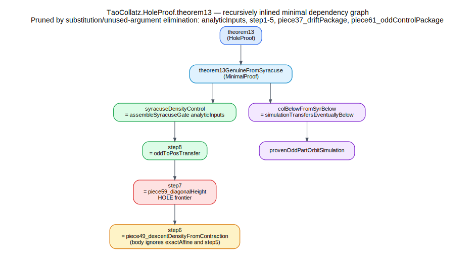
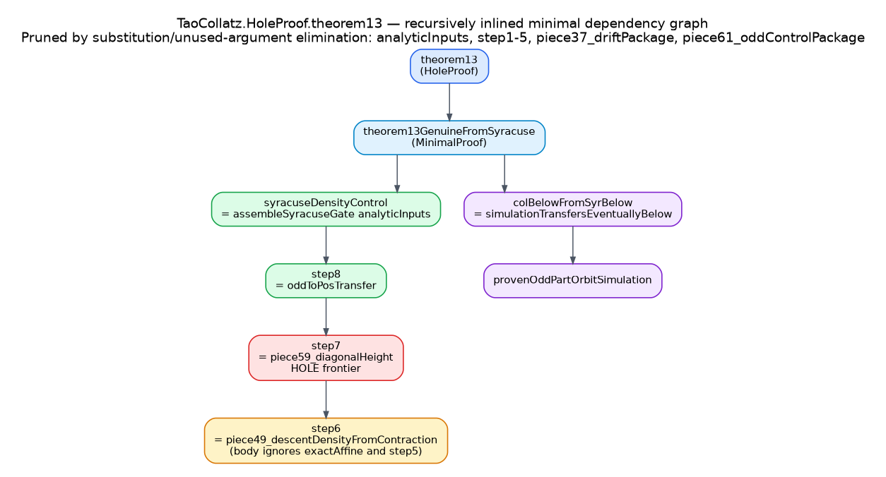

# `TaoCollatz.HoleProof.theorem13`: recursively inlined minimal graph

This note reduces the closed main theorem
`/home/runner/work/tao_collatz_idris2_formalization/tao_collatz_idris2_formalization/TaoCollatz/HoleProof.idr`
by recursively substituting definitional wrappers, deleting identity packagers,
and pruning arguments that the resulting terms do not use.

## Output

- SVG: `/home/runner/work/tao_collatz_idris2_formalization/tao_collatz_idris2_formalization/theorem13_minimal_graph.svg`
- PNG: `/home/runner/work/tao_collatz_idris2_formalization/tao_collatz_idris2_formalization/theorem13_minimal_graph.png`

## What was inlined

- `theorem13 = theorem13GenuineFromSyracuse syracuseDensityControl`
  (`HoleProof.idr:323-324`)
- `syracuseDensityControl = assembleSyracuseGate analyticInputs`
  (`HoleProof.idr:314-315`)
- `assembleSyracuseGate inputs = step8 (step7 (step6 (step5 (step4 (step3 (step2 (step1 inputs)))))))`
  (`HoleProof.idr:302-304`)
- `colBelowFromSyrBelow x bound syr = simulationTransfersEventuallyBelow provenOddPartOrbitSimulation ...`
  (`MinimalProof.idr:113-129`)
- `step8 odc = oddToPosTransfer odc`
  (`HoleProof.idr:288-289`)
- `step7 t = piece61_oddControlPackage (piece59_diagonalHeight t)` and
  `piece61_oddControlPackage h = h`
  (`HoleProof.idr:282-289`, `Pieces64.idr:857-865`)
- `step6 = piece63_step6` with
  `piece63_step6 cdd = piece49_descentDensityFromContraction exactAffine cdd`
  (`HoleProof.idr:276-277`, `Pieces64.idr:876-879`)

## What was pruned

After substitution, the following dependencies disappear from the actual term:

- `step3 _ = affineBackbone`, so `step3` does not use `step2`
  (`HoleProof.idr:242-245`)
- `step4 = piece62_step4` and `piece62_step4 _ = piece37_driftPackage piece36_uniformLateDrift`,
  so `step4` does not use the `ExactAffineDynamics` result of `step3`
  (`HoleProof.idr:249-251`, `Pieces64.idr:871-874`)
- `piece37_driftPackage h = h`, so the packager itself disappears
  (`Pieces64.idr:500-510`)
- `piece49_descentDensityFromContraction _ _ = ...`, so `step6` does not use
  either `exactAffine` or the `ContractionDominatesDensity` output of `step5`
  (`Pieces64.idr:678-693`)

Therefore the current closed theorem term is **not actually dependent on**

- `analyticInputs`
- `step1`
- `step2`
- `step3`
- `step4`
- `step5`

or on any transitive inputs that only feed those nodes
(`syracuseStepContractionFour`, `genuineTailEstimate`, `goodStepDescentSet`,
`iteratedGrowthProof`, `contractionArith`, `piece36_uniformLateDrift`, and the
drift/tail branch beneath them).

## The resulting minimal graph

The live dependency surface of the closed theorem is:

1. the **Syracuse gate branch**
   `step6 -> step7 -> step8 -> syracuseDensityControl`
2. the **proved transfer branch**
   `provenOddPartOrbitSimulation -> colBelowFromSyrBelow`
3. the join
   `theorem13GenuineFromSyracuse -> theorem13`

In the current code, the only unresolved frontier that still lies on that
pruned critical path is the step-7 hole
`piece59_diagonalHeight` (`Pieces64.idr:849-855`).
